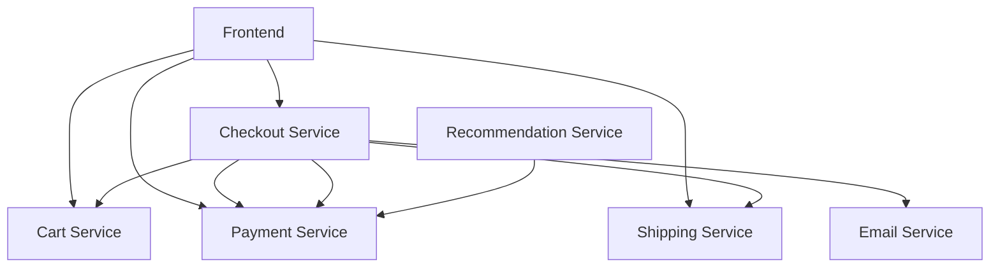

# Azure DevOps CI/CD Pipeline for Cloud-Native Microservices E-Commerce Platform


## Project Overview
This enterprise-grade microservices application demonstrates a modern cloud-native architecture integrated with Azure DevOps CI/CD practices. The project showcases end-to-end implementation of a scalable e-commerce platform using industry-standard technologies and best practices.

## Technology Stack

### Infrastructure & DevOps
- **Cloud Platform**: Microsoft Azure
- **Container Orchestration**: Azure Kubernetes Service (AKS)
- **CI/CD**: Azure DevOps Pipelines
- **Infrastructure as Code**: 
  - Terraform for Azure resources
  - Azure ARM templates
  - Kubernetes manifests
- **Container Registry**: Azure Container Registry (ACR)
- **Service Mesh**: Istio
- **Monitoring & Observability**:
  - Azure Monitor
  - Azure Application Insights
  - Azure Log Analytics

### Microservices Architecture
| Service | Technology Stack | Description |
|---------|-----------------|-------------|
| Frontend Service | Go, React | Modern web interface with responsive design |
| Cart Service | .NET Core, Redis | Shopping cart management with in-memory caching |
| Product Catalog Service | Go, gRPC | Product inventory and catalog management |
| Currency Service | Node.js, gRPC | Real-time currency conversion |
| Payment Service | Node.js, gRPC | Payment processing integration |
| Shipping Service | Go, gRPC | Shipping cost calculation and tracking |
| Email Service | Python, gRPC | Transactional email notifications |
| Checkout Service | Go, gRPC | Order processing and fulfillment |
| Recommendation Service | Python, gRPC | ML-based product recommendations |
| Advertisement Service | Java, gRPC | Targeted advertisement system |
| Load Generator | Python, Locust | Performance testing and load simulation |

### Development Tools & Technologies
- **Languages**: Go, Python, Java, C#, Node.js
- **Protocols**: gRPC, REST
- **Database**: Redis
- **Testing**:
  - JUnit (Java)
  - PyTest (Python)
  - xUnit (.NET)
  - Go testing framework
- **API Documentation**: Swagger/OpenAPI
- **Version Control**: Git
- **Code Quality**: 
  - SonarQube
  - Azure DevOps Code Analysis

### Security & Compliance
- Azure Key Vault for secrets management
- Azure AD for authentication
- Network Security Groups
- Kubernetes RBAC
- SSL/TLS encryption
- Container security scanning

### Deployment Strategies
- Blue-Green Deployment
- Canary Releases
- A/B Testing capability
- Rolling Updates

**Online Boutique** is a cloud-native microservices demo application, enhanced with Azure DevOps CI/CD pipelines. This application demonstrates modern DevOps practices and cloud-native architecture patterns.

The application is a web-based e-commerce platform consisting of 11 microservices where users can browse items, add them to cart, and purchase them. It serves as an excellent example for implementing:

- Azure DevOps CI/CD Pipelines
- Infrastructure as Code (IaC) with Azure ARM templates
- Containerization with Docker
- Container Orchestration with Azure Kubernetes Service (AKS)
- Azure Container Registry (ACR)
- Azure Monitor for containers
- Azure Application Insights

## Azure DevOps CI/CD Features

- **Continuous Integration:**
  - Automated builds for all microservices
  - Unit and integration testing
  - Code quality checks with SonarQube
  - Container image scanning
  - Artifact publishing to Azure Container Registry

- **Continuous Deployment:**
  - Multi-stage deployment pipelines
  - Environment-specific configurations
  - Automated deployment to AKS
  - Blue-Green deployment support
  - Rollback capabilities
  - Infrastructure as Code deployment

## DevOps Pipeline Structure

```yaml
// ... existing code ...
```

## Architecture

**Online Boutique** is composed of 11 microservices written in different
languages that talk to each other over gRPC. The application is containerized and orchestrated using Azure Kubernetes Service.

[](/docs/img/architecture-diagram.png)

| Service                                              | Language      | Description                                                                                                                       |
| ---------------------------------------------------- | ------------- | --------------------------------------------------------------------------------------------------------------------------------- |
| [frontend](/src/frontend)                           | Go            | Exposes an HTTP server to serve the website. Does not require signup/login and generates session IDs for all users automatically. |
| [cartservice](/src/cartservice)                     | C#            | Stores the items in the user's shopping cart in Redis and retrieves it.                                                           |
| [productcatalogservice](/src/productcatalogservice) | Go            | Provides the list of products from a JSON file and ability to search products and get individual products.                        |
| [currencyservice](/src/currencyservice)             | Node.js       | Converts one money amount to another currency. Uses real values fetched from European Central Bank. It's the highest QPS service. |
| [paymentservice](/src/paymentservice)               | Node.js       | Charges the given credit card info (mock) with the given amount and returns a transaction ID.                                     |
| [shippingservice](/src/shippingservice)             | Go            | Gives shipping cost estimates based on the shopping cart. Ships items to the given address (mock)                                 |
| [emailservice](/src/emailservice)                   | Python        | Sends users an order confirmation email (mock).                                                                                   |
| [checkoutservice](/src/checkoutservice)             | Go            | Retrieves user cart, prepares order and orchestrates the payment, shipping and the email notification.                            |
| [recommendationservice](/src/recommendationservice) | Python        | Recommends other products based on what's given in the cart.                                                                      |
| [adservice](/src/adservice)                         | Java          | Provides text ads based on given context words.                                                                                   |
| [loadgenerator](/src/loadgenerator)                 | Python/Locust | Continuously sends requests imitating realistic user shopping flows to the frontend.                                              |

## Quick Start with Azure DevOps

1. **Prerequisites:**
   - Azure subscription
   - Azure DevOps organization and project
   - Azure CLI installed
   - Docker installed locally

2. **Set up Azure Resources:**
   ```sh
   # Login to Azure
   az login
   
   # Create Resource Group
   az group create --name online-boutique-rg --location eastus
   
   # Create AKS Cluster
   az aks create --resource-group online-boutique-rg --name online-boutique-aks --node-count 3
   
   # Create Azure Container Registry
   az acr create --resource-group online-boutique-rg --name onlineboutiqueacr --sku Standard
   ```

3. **Configure Azure DevOps Pipeline:**
   - Import this repository into Azure Repos
   - Create new pipeline using the azure-pipelines.yml
   - Set up service connections for Azure subscription and AKS
   - Configure environment variables and secrets

4. **Deploy the Application:**
   - Run the pipeline
   - Monitor deployment progress
   - Access the application through AKS ingress endpoint

## Monitoring and Observability

- Application monitoring with Azure Application Insights
- Container insights through Azure Monitor
- Custom dashboards for service metrics
- Log Analytics workspace integration
- Alert rules and action groups


## Project Structure

```
azure-devops-microservices/
├── .azure/                      # Azure DevOps pipeline definitions
│   ├── pipelines/              # YAML pipeline definitions
│   ├── templates/              # Reusable pipeline templates
│   └── variables/              # Pipeline variables and settings
├── infrastructure/             # Infrastructure as Code
│   ├── terraform/              # Terraform configurations
│   ├── arm-templates/          # Azure ARM templates
│   └── scripts/                # Infrastructure scripts
├── kubernetes/                 # Kubernetes configurations
│   ├── manifests/             # K8s resource definitions
│   ├── helm-charts/           # Helm chart definitions
│   └── istio/                 # Service mesh configurations
├── src/                       # Microservices source code
│   ├── ms-frontend/          # Frontend service
│   ├── ms-cart/              # Cart service
│   ├── ms-catalog/           # Product catalog service
│   ├── ms-currency/          # Currency service
│   ├── ms-payment/           # Payment service
│   ├── ms-shipping/          # Shipping service
│   ├── ms-email/             # Email service
│   ├── ms-checkout/          # Checkout service
│   ├── ms-recommendation/    # Recommendation service
│   ├── ms-ads/               # Advertisement service
│   └── ms-loadgen/           # Load generator
├── tests/                     # Test suites
│   ├── integration/          # Integration tests
│   ├── e2e/                  # End-to-end tests
│   └── performance/          # Performance tests
└── docs/                     # Documentation
    ├── architecture/         # Architecture diagrams
    ├── deployment/          # Deployment guides
    └── development/         # Development guides
```

## Inter-Service Communication with gRPC

### gRPC Overview
The microservices in this application communicate using gRPC (Google Remote Procedure Call), a high-performance, open-source RPC framework. gRPC uses Protocol Buffers (protobuf) for service definitions and data serialization.

### Service Communication Patterns

#### 1. Synchronous Request-Response
- **Checkout Flow Example:**
  ```
  Frontend -> Cart Service: GetCart(user_id)
  Frontend -> Shipping Service: GetShippingQuote(cart_items)
  Frontend -> Payment Service: ProcessPayment(total_amount)
  ```

#### 2. Server Streaming
- **Product Catalog Updates:**
  ```
  Product Catalog Service -> Frontend: StreamProductUpdates()
  Product Catalog Service -> Recommendation Service: StreamCatalogChanges()
  ```

### Protocol Buffer Definitions
Located in `/protos` directory, these define the service interfaces:

```protobuf
// Example: Cart Service Proto
service CartService {
    rpc AddItem(AddItemRequest) returns (Empty) {}
    rpc GetCart(GetCartRequest) returns (Cart) {}
    rpc EmptyCart(EmptyCartRequest) returns (Empty) {}
}

message AddItemRequest {
    string user_id = 1;
    CartItem item = 2;
}

message Cart {
    string user_id = 1;
    repeated CartItem items = 2;
}
```

### Service Dependencies


### gRPC Implementation by Service

| Service | Role | gRPC Methods |
|---------|------|--------------|
| Frontend | Client | Initiates requests to all backend services |
| Cart Service | Server/Client | `AddItem`, `GetCart`, `EmptyCart` |
| Product Catalog | Server | `ListProducts`, `GetProduct`, `SearchProducts` |
| Currency | Server | `Convert`, `GetSupportedCurrencies` |
| Payment | Server | `Charge`, `ValidatePayment` |
| Shipping | Server | `GetQuote`, `ShipOrder` |
| Email | Server | `SendOrderConfirmation`, `SendShippingUpdate` |
| Checkout | Client/Server | Orchestrates calls between services |
| Recommendation | Server | `ListRecommendations` |
| Ad Service | Server | `GetAds` |

### gRPC Benefits in Our Architecture
1. **Performance**
   - Binary protocol (Protocol Buffers) instead of text-based JSON
   - HTTP/2 for multiplexing and streaming
   - Efficient serialization/deserialization

2. **Type Safety**
   - Strongly typed service definitions
   - Automatic code generation for all services
   - Compile-time type checking

3. **Cross-Platform & Cross-Language**
   - Seamless communication between services in different languages
   - Consistent API contracts across the platform
   - Language-agnostic service definitions

4. **Streaming Capabilities**
   - Bi-directional streaming for real-time updates
   - Server streaming for data feeds
   - Client streaming for batch operations

### Error Handling and Resilience
- gRPC status codes for standardized error handling
- Retry mechanisms for transient failures
- Circuit breakers for fault tolerance
- Deadline propagation across service calls

### Monitoring and Debugging
- gRPC metrics exposed through Azure Application Insights
- Tracing with OpenTelemetry integration
- Service mesh observability with Istio
- Custom middleware for logging and monitoring

### Security
- TLS encryption for all gRPC communications
- Service-to-service authentication using mTLS
- Azure AD integration for service identity
- Request/Response validation at protocol level
